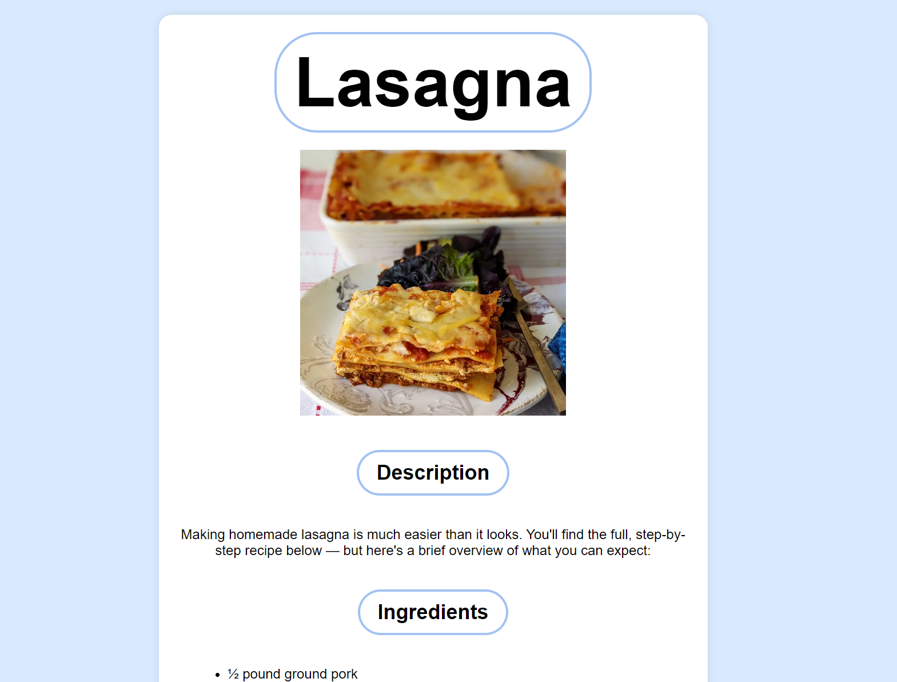

# Recipes Beginner Website Example
A simple website that displays use of linking other pages together and displaying information effectively

## Main Page

## Secondary Page

## Home Button
Aesthetic home button at the bottom

